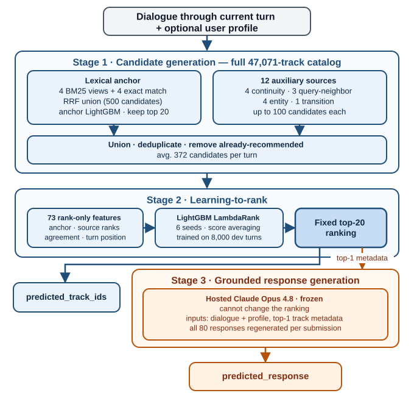

# Auditing Alignment among Item Relevance, Goal Progress, and LLM-Judged Responses in Music-CRS

**Authors:** Tomoya Terai (DMM.com LLC) — <terai-tomoya@dmm.com>

**Team:** Komekami

**Code:** <https://github.com/tmp-friends/music-crs-challenge-2026> [TODO: confirm that the repository is public and matches the submitted system]

> **Submission note (not part of the manuscript):** Evaluation-alignment proposal; draft status: 2026-07-24 (language simplified and condensed to fit the page limit). The official RecSys Challenge 2026 Timeline currently shows that the paper deadline was extended from **20 July 2026 to 24 July 2026**, and the notification date from 3 August to 5 August. The Paper Submission Guidelines block on the same page still displays the old dates, so the authors must confirm the effective deadline in EasyChair before submission. Source: <https://www.recsyschallenge.com/2026/>.
>
> This draft targets the ACM RecSys Challenge 2026 workshop format: 4 pages of body text plus 1 page of references, in `acmart` `sigconf` double-column format. Bracketed TODOs must be resolved before submission.

## Abstract

The official evaluation of the RecSys Challenge 2026 Music-CRS task can disagree with itself. The task scores a ranked list of 20 tracks and a natural-language response per turn with a single composite of nDCG@20, catalog and lexical diversity, and an LLM judge. Auditing the released training data and the interim leaderboard, we find two internal conflicts. First, the accuracy target contradicts the dataset's own goal labels. When a listener explicitly asks for a different artist, the next ground-truth track still stays with an artist the session has already played in 76.0% of cases, 12.9 points more often than on other turns. The pattern sharpens when the dataset's own goal-progress label marks the preceding same-artist recommendation as unsuccessful. The next track then repeats that very artist in 85.8% of cases. A ranker that follows the user's request is therefore penalized by nDCG. Second, the response terms of the composite move independently of the recommendations. We froze one top-20 ranking on the blind leaderboard and rewrote only the responses. The composite rose by 0.0843, which equals the contribution of a +0.17 nDCG@20 gain. The composite cannot tell better recommendations from better-worded explanations. We recommend reporting goal adherence and ranking--response consistency alongside it. Team Komekami ranked 8th in the Industry Track and 16th among 40 teams.

**CCS Concepts:** • Information systems → Recommender systems; Evaluation of retrieval results.

**Keywords:** RecSys Challenge, Conversational Recommendation, Music Recommendation, Evaluation Metrics, LLM-as-a-Judge, Synthetic Data

## 1 Introduction

When a listener in the RecSys Challenge 2026 Music-CRS training data explicitly asks for a different artist, the next ground-truth track usually stays with an artist the session has already played, so a ranker that faithfully follows the request loses nDCG exactly where the user asked for change. This paper measures that tension, and a second one like it, inside the challenge's official evaluation.

Music-CRS scores, for each evaluation turn, a ranked list of 20 catalog tracks and a natural-language response with a single composite: nDCG@20, catalog and lexical diversity, and a Gemini-family LLM judge [1]. Our central claim is that item relevance, goal adherence, and judged response quality are related but different quantities that can pull a system in different directions.

Prior work has criticized conversational-recommendation evaluations that reduce success to matching one held-out item or utterance [3]; LLM judges scale well but exhibit verbosity bias [4] and favor their own generations [5]; and an earlier RecSys Challenge ranked submissions on accuracy alone, giving participants no incentive to pursue its stated diversity goals [6]. What has not been checked, to our knowledge, is whether a challenge composite disagrees *with itself*: whether its accuracy target contradicts the dataset's own goal labels, and how far its response terms move under a fixed ranking, both measurable on Music-CRS.

We ask two questions:

- **RQ1:** When a listener explicitly asks for a different artist, does the next ground-truth track actually change artists, and does the dataset's own goal-progress label register the conflict?
- **RQ2:** With the full ranked list frozen, how much do the official response metrics move on the leaderboard when only the way the response is written changes?

Our contribution is an evaluation-alignment audit:

- a full-training-split analysis of item--goal alignment with session-level confidence intervals and a manually validated pivot detector;
- a hash-verified comparison of five response styles under one fixed ranking, scored by the official Blind-A evaluator;
- reporting recommendations for conversational evaluation.

## 2 Task, Data, and Metrics

Given the dialogue up to the current user request and, when available, the user profile and the released metadata and embeddings, a system must return a ranked list of 20 track IDs drawn from the full catalog, together with a natural-language response that explains the recommendation. On the development split every recommendation turn is a target (8,000 turns). The blind splits score one turn per session.

### 2.1 TalkPlayData-Challenge

Music-CRS builds on TalkPlayData 2, a synthetic conversational music dataset generated by a pipeline of LLM agents [2]. A Listener agent, which knows the session goal and the user profile, converses with a Recsys agent, which sees the profile but not the goal. Each session is generated in the order `music[t-1]` → `progress/message[t]` → `music[t]`. The Listener labels whether the previous recommendation makes progress toward the goal and writes the next request before the Recsys agent picks the current track [2]. The challenge release contains 15,199 training and 1,000 development sessions, each with eight recommendation turns. The catalog holds 47,071 tracks, and turns 2--8 carry 106,393 progress labels.

Blind A and Blind B each contain 80 evaluation turns (one per session) with hidden relevant tracks. Blind A backed an interim leaderboard that returned official scores during the challenge. Blind B decided the final ranking. Blind B also removes the progress and reasoning fields and withholds the user identifier and profile for 40 cold-start cases, a distribution shift we revisit in Section 6.3.

### 2.2 Official metrics and audit scope

The composite has four parts [1]:

- **nDCG@20 (weight 0.50):** rewards ranking high the single *relevant track* attached to each turn (`music[t]`).
- **Catalog diversity (weight 0.10):** unique recommended tracks across the whole prediction file, as a fraction of the catalog.
- **Lexical diversity (weight 0.10):** corpus-level Distinct-2 over the responses.
- **LLM judge (weight 0.30):** personalization and explanation quality on a 1--5 scale, mapped linearly to [0,1] before aggregation.

The judge's model family is disclosed; its prompt and per-example scores are not. RQ1 uses only the released training split and track metadata, and treats the progress labels `MOVES_TOWARD_GOAL` and `DOES_NOT_MOVE_TOWARD_GOAL`, the Listener's private annotations, as synthetic artifacts of data generation, not as human satisfaction judgments. RQ2 uses official scores of Blind-A submissions from the open interim phase.

## 3 Submitted System

Our system separates track selection from response generation (Figure 1). The ranking path is a two-stage recommender cascade in the tradition of [11]: candidate generation with a learned first-stage ranker, then a reranker over the merged pool. It uses only official challenge data and always searches the full 47,071-track catalog. A final stage writes a response for the fixed recommendation.

*Figure 1: The submitted pipeline.*

### 3.1 Candidate generation

For each target turn, the system sees the dialogue up to the current request and, when available, the user profile. An anchor stage fuses eight lexical signals into a 500-candidate pool by reciprocal-rank fusion: four BM25S [7] views over catalog text indexes and four exact-match rules for explicitly mentioned tracks, artists, albums, and tags. A first-stage LightGBM classifier trained on the 121,592 training turns then reorders the pool, and its top 20 anchor the candidate union. Twelve auxiliary sources each add up to 100 candidates from four families: session-local artist/album/tag continuity, BM25 neighbors from official training tasks, catalog entities mentioned in recent user text, and entity-to-track transitions learned from training sessions. After merging, deduplication, and removal of tracks already recommended in the session, the development pool averages 372 candidates per target and contains the relevant track for 54.16% of the 8,000 targets.

### 3.2 Learning to rank

Each candidate is described by 73 rank-only features: its rank and top-k membership in the anchor and in each source, cross-source agreement, and turn position. Content, embedding, and train-statistics features were deliberately excluded after their development gains repeatedly inverted on Blind A. As a side effect, the ranker never reads the user identifier. Because the neighbor and transition sources are built from training-split ground truth, this fusion stage is trained on the 8,000 development turns instead, avoiding self-leakage. Six LightGBM models with the LambdaRank objective [8, 9], identical except for the random seed, treat each session-turn as a ranking group with its single relevant track as the positive item. Averaging their scores damps the roughly ±0.02 retraining fluctuation of 80-turn blind scores. On Blind A, the official BM25 baseline scores nDCG@20 0.1938, the anchor alone 0.3869, and the full pipeline 0.4355.

### 3.3 Grounded response generation

Once the ranking is fixed, a hosted `claude-opus-4-8` model (no fine-tuning) receives only the dialogue so far, the available profile, and metadata of the top-ranked track. The prompt requires the explanation to stay within these inputs and forbids invented track attributes. Its style is the best-scoring bundle of Table 2. The generator cannot change the ranking, and all 80 responses are regenerated for every submission so that the text always matches its final top track. The ranking path is deterministic given trained models and indexes. Response wording depends on the hosted model.

On Blind B, the selected submission scored composite 0.4998 (nDCG@20 0.3528, LLM judge 4.30), ranking 8th in the Industry Track and 16th among 40 teams [10].

## 4 Audit Method

### 4.1 RQ1: does the ground truth follow artist-change requests?

By the generation order of Section 2.1, the progress label at turn `t` rates the previous recommendation, and the music row at `t` is the next relevant track, chosen after the current request. We join music rows to catalog metadata, comparing tracks on their sets of lowercased artist names (a multi-artist track matches on any shared name), and call the relevant track at `t` a *session-artist repeat* if it shares an artist with any earlier music turn in the session. For `t>=3`, we apply the same definition to the previous recommendation.

We detect explicit change requests (*pivots*) with three simple, case-insensitive lexical rules over the user message:

- **artist-targeted**: change phrases naming an artist, band, singer, or other person (“a different artist”, “a band I haven't heard”);
- **broad**: also accepts generic phrases (“something new”, “discover something different”);
- **core**: centered on “different”, “another”, and “someone else” (“another artist”, “by someone else”).

The three rules are alternative definitions rather than nested filters. Because the manual audit below gives the artist-targeted rule the highest precision, it is our primary rule, with the other two as sensitivity checks.

For each rule we report, within its pivot turns, the quantities of Table 1, including a *high-conflict* slice (pivot message, preceding same-artist recommendation, `DOES_NOT_MOVE_TOWARD_GOAL` label). Pivots concentrate in later turns, where artist repeats are also more common, so we compare the two groups at each turn and reweight both to the pooled turn distribution. Confidence intervals come from resampling whole sessions 5,000 times (seed 20260720). A logistic model with turn fixed effects and session-clustered errors serves as a secondary check. Code, public inputs, and result tables are released in the repository above.

To validate the rules, one annotator blindly labeled 200 stratified turns (50 broad-rule positives from the high-conflict slice, 50 other broad-rule positives, 100 broad-rule negatives) as `ARTIST_PIVOT`, `NOT_ARTIST_PIVOT`, or `UNCERTAIN`, seeing only the request and the preceding dialogue. Strata follow the widest (broad) rule, so reweighting each stratum to the 106,393-turn population yields precision, recall, and F1 for all three rules (session bootstrap, seed 20260723). We exclude `UNCERTAIN` cases from the binary metrics and report them as coverage.

### 4.2 RQ2: response metrics under a frozen ranking

We take one Blind-A submission (nDCG@20 0.4355, catalog diversity 0.0280), freeze all 20 predicted track IDs per turn, and swap in five response sets, regenerating all 80 responses each time (Table 2):

- **Initial**: the pipeline's original Qwen3.5-4B prompt;
- **Qwen 4B, revised**: the same generator, but suppressing apologies, forbidding invented attributes, and rotating opening styles;
- **Claude, short** (~75 words): generation moved to a hosted Claude model;
- **Claude, grounded long** (~120 words): adding metadata grounding, enthusiasm, and question endings;
- **Gemini Pro, grounded**: the grounded prompt applied to Gemini with extended reasoning.

We verify that the rankings are identical by hashing every ordered top-20 list, and split each composite change into its lexical and judge parts.

## 5 Results

### 5.1 RQ1: negative feedback does not redirect the next relevant track

Table 1 summarizes the audit. If the ground truth followed artist-change requests, repeats would be rarer on pivot turns; the opposite holds. Under the primary rule, the next relevant track is a session-artist repeat on 76.3% of the 15,126 pivot turns (`Next same` in Table 1). After the turn reweighting of Section 4.1, this rate is 76.0%, against 63.1% on non-pivot turns. The table reports the gap as the +12.9-point turn-adjusted difference. The gap is positive at every turn taken separately (9.0--17.1 points), and the secondary logistic check gives an odds ratio of 1.90 (95% CI: 1.81--2.01).

The progress labels do register the conflict. On pivot turns at `t>=3`, the label rating the previous turn's recommendation reads `MOVES_TOWARD_GOAL` in 56.3% of cases when that recommendation was itself a session-artist repeat, against 78.5% when it introduced a new artist. The relevant track chosen right after this judgment ignores it: in the high-conflict slice of Table 1 (pivot message, preceding same-artist recommendation, `DOES_NOT_MOVE_TOWARD_GOAL` label), 4,529 of 5,278 relevant tracks (85.8%; 95% CI: 84.7--86.8) repeat the immediately preceding artist.

**Table 1: Pivot audit under three lexical rules. `Next same`: share of pivot turns whose next relevant track repeats a session artist. `Turn-adj. diff`: pivot minus non-pivot gap after reweighting to the pooled turn distribution (pp; 95% session-bootstrap CI). `Prior MOVES same/diff`: share of preceding recommendations labeled `MOVES_TOWARD_GOAL`, by whether they repeated a session artist (`t>=3`). `Conflict repeats previous`: share of high-conflict turns repeating the immediately preceding artist (n in parentheses).**

| Pivot rule | Pivot turns | Next same | Turn-adj. diff | Prior `MOVES` same/diff | Conflict repeats previous |
|---|---:|---:|---:|---:|---:|
| **Artist-targeted (primary)** | 15,126 | 76.3% | +12.9 pp [11.8, 14.0] | 56.3% / 78.5% | 85.8% (n=5,278) |
| Broad discovery/change | 10,982 | 77.0% | +12.6 pp [11.5, 13.7] | 43.2% / 69.1% | 85.9% (n=4,899) |
| Core change | 7,147 | 80.1% | +16.0 pp [14.7, 17.2] | 46.1% / 71.7% | 86.2% (n=3,227) |

The manual audit yields 194 classifiable cases out of the 200 annotated turns, covering 95.4% of the turn population after stratum reweighting. Against these labels, the primary rule has precision 0.992 (95% CI: 0.970--1.000), recall 0.322 (0.225--0.435), and F1 0.486; the broad rule reaches 0.904 and 0.218, the core rule 0.983 and 0.160. All three rules are high-precision but low-recall: false positives are too rare to explain the repeat rates above, and low recall limits coverage, not precision (Section 6.3).

### 5.2 RQ2: large composite changes under an identical ranking

Table 2 reports official Blind-A scores for five response sets over one identical ranking, so all movement comes from lexical diversity and the LLM judge. The best bundle (Claude, grounded long) improves the composite by 0.0843 over the initial responses: 0.0638 from the normalized judge term (75.6%) and 0.0206 from lexical diversity (24.4%; components rounded). Under the official weights, this equals the composite effect of a +0.1687 nDCG@20 improvement. The point is not that the two changes are equally valuable to users, but that the composite cannot tell them apart.

**Table 2: Blind-A response variants with all 20 ranked tracks fixed (bundles: Section 4.2).**

| Response variant | Lexical diversity | LLM judge | Composite |
|---|---:|---:|---:|
| Initial response | 0.5925 | 4.05 | 0.5086 |
| Qwen 4B, revised | 0.6605 | 4.20 | 0.5266 |
| Claude, short | **0.8133** | 4.30 | 0.5494 |
| Claude, grounded long | 0.7983 | **4.90** | **0.5929** |
| Gemini Pro, grounded | 0.7204 | 4.30 | 0.5401 |

## 6 Discussion

### 6.1 The metrics measure different things

Two gaps emerge. The first separates item accuracy from goal adherence. A ranker that faithfully follows the pivot misses the positive (Table 1). The same holds in training. Our learning-to-rank positives (Section 3.2) are these nDCG targets, so any system optimized for the composite inherits the repetition pattern by construction. The data pipeline suggests why: each next track is drawn from a pool derived from one listening session [2], and such pools are internally coherent, so the pool-level target can contradict the text-level request. The second gap separates response quality from recommendation correctness. Response scores moved substantially under an identical ranking (Table 2). Neither gap makes any single metric invalid. The risk is reading their weighted sum as one measure of conversational quality. Blind artist diversification is no fix either. In our development experiments, demoting same-artist candidates on pivot turns lowered nDCG, and the promoted alternatives usually violated the user's remaining constraints.

### 6.2 Recommendations for conversational evaluation

We suggest three complementary reporting practices to challenge organizers and benchmark builders.

1. **Report goal adherence separately.** For explicit pivots, check whether the recommendation respects the requested change (artist, genre, era, tempo, novelty) instead of inferring success only from one held-out item. Our released pivot detector already implements the artist case.
2. **Score ranking--response consistency.** Give the judge the recommended track's metadata and have it score whether the explanation matches that track, separately from prose quality.
3. **Calibrate the judge and publish slices.** Validate the judge on a stratified human-annotated subset (short/long responses, cold/warm users, matched/mismatched recommendations), and break scores out for pivot turns and prior-artist targets.

These additions complement rather than replace nDCG and LLM judging, echoing earlier calls to make beyond-accuracy goals operational [6].

### 6.3 Limitations

Our audit is observational and the data are synthetic, so we estimate neither human satisfaction nor causal effects. Turn adjustment does not remove unmeasured session or intent differences. The manual intent audit has a single annotator, and the English-only lexical rules have low recall, so they characterize high-precision slices, not how common artist pivots are. On RQ2, the five bundles change several factors at once and share one frozen ranking. Blind A has only 80 targets, and the Blind-B distribution shift further cautions against treating Blind-A differences as stable effects. Human annotation of response grounding is the natural follow-up.

## 7 Conclusion

Item relevance, goal adherence, and judged response quality in Music-CRS are related but not interchangeable: the ground-truth track repeats the just-rejected artist in 85.8% of the sharpest conflict cases, and rewriting the responses alone under a frozen ranking moved the composite by 0.0843. Reporting goal adherence and ranking--response consistency alongside it would make progress easier to interpret.

## References

[1] RecSys Challenge 2026. 2026. “Conversational Music Recommendation.” <https://www.recsyschallenge.com/2026/>.

[2] Keunwoo Choi, Seungheon Doh, and Juhan Nam. 2025. “TalkPlayData 2: An Agentic Synthetic Data Pipeline for Multimodal Conversational Music Recommendation.” arXiv:2509.09685. <https://arxiv.org/abs/2509.09685>.

[3] Xiaolei Wang, Xinyu Tang, Wayne Xin Zhao, Jingyuan Wang, and Ji-Rong Wen. 2023. “Rethinking the Evaluation for Conversational Recommendation in the Era of Large Language Models.” In *Proceedings of EMNLP 2023*, 10052--10065. <https://arxiv.org/abs/2305.13112>.

[4] Lianmin Zheng, Wei-Lin Chiang, Ying Sheng, et al. 2023. “Judging LLM-as-a-Judge with MT-Bench and Chatbot Arena.” In *Advances in Neural Information Processing Systems 36, Datasets and Benchmarks Track*. <https://arxiv.org/abs/2306.05685>.

[5] Arjun Panickssery, Samuel R. Bowman, and Shi Feng. 2024. “LLM Evaluators Recognize and Favor Their Own Generations.” In *Advances in Neural Information Processing Systems 37*. <https://arxiv.org/abs/2404.13076>.

[6] Lucien Heitz, Oana Inel, and Sanne Vrijenhoek. 2024. “Recommendations for the Recommenders: Reflections on Prioritizing Diversity in the RecSys Challenge.” In *Proceedings of the ACM RecSys Challenge 2024*, 22--26. <https://doi.org/10.1145/3687151.3687155>.

[7] Xing Han Lù. 2024. “BM25S: Orders of Magnitude Faster Lexical Search via Eager Sparse Scoring.” arXiv:2407.03618. <https://arxiv.org/abs/2407.03618>.

[8] Guolin Ke, Qi Meng, Thomas Finley, et al. 2017. “LightGBM: A Highly Efficient Gradient Boosting Decision Tree.” In *Advances in Neural Information Processing Systems 30*. <https://dl.acm.org/doi/10.5555/3294996.3295074>.

[9] Christopher J. C. Burges. 2010. “From RankNet to LambdaRank to LambdaMART: An Overview.” Microsoft Research Technical Report MSR-TR-2010-82. <https://www.microsoft.com/en-us/research/publication/from-ranknet-to-lambdarank-to-lambdamart-an-overview/>.

[10] Music-CRS Challenge 2026. 2026. “Final Results: Blind-Dataset-B.” <https://nlp4musa.github.io/music-crs-challenge/results.html>.

[11] Maksims Volkovs, Himanshu Rai, Zhaoyue Cheng, Ga Wu, Yichao Lu, and Scott Sanner. 2018. “Two-stage Model for Automatic Playlist Continuation at Scale.” In *Proceedings of the ACM Recommender Systems Challenge 2018*. <https://doi.org/10.1145/3267471.3267480>.

---

## Author TODOs — not part of the manuscript

1. ✅ (2026-07-24) Author filled in: Tomoya Terai, DMM.com LLC, <terai-tomoya@dmm.com>. Team name Komekami appears in the abstract and body. Confirm it matches the registered team name exactly.
2. Confirm that <https://github.com/tmp-friends/music-crs-challenge-2026> is public, sanitized, and reproduces the selected `lgbm6_nocs_B` system from Blind B through `prediction.json`.
3. Confirm the **24 July 2026** deadline in EasyChair. The official Timeline shows the extension, but the guidelines block on the same webpage still contains 20 July.
4. If available, download the one remaining historical artifact (`submission_exp014_ab_s06_t500fb_A.zip`) from the original Codabench submission record or a backup, place it at the ledger path, and rerun the released audit script before camera-ready. Do not substitute a newly generated response file for the originally scored artifact.
5. Add a small human audit comparing response grounding, personalization, and verbosity across the five Table 2 variants. Without it, avoid claiming that a higher judge score means a better human-facing response.
6. ✅ (2026-07-24) `figures/system_pipeline.pdf` generated from the SVG via cairosvg; it renders correctly in the compiled PDF (all text and arrows intact). Optionally re-export from drawio for camera-ready if font embedding needs to match ACM requirements exactly.
7. ✅ (2026-07-24) Converted to `\documentclass[sigconf]{acmart}` at `latex/main.tex` and compiled (`latex/main.pdf`, via tectonic). **Measured: body ends on page 4; references end early on page 5 → 4P+1P satisfied with ~3/4 page of slack** for the real author block and camera-ready changes. Re-verify after filling in authors. *(2026-07-25 update: the rewritten abstract pushed ~6 body lines onto page 5; Figure 1 was reduced from 0.92 to 0.78 `\columnwidth` to pull the conclusion back onto page 4. 4P+1P holds again, but slack is now minimal and the in-figure labels are smaller — recheck figure-text legibility at camera-ready, or trim ~6 lines of body text and restore the figure size.)* *(2026-07-25 second update: Introduction rewritten — cold open, composite inlined, "composite disagrees with itself" gap statement, findings-preview paragraph, enumerated contributions (i)–(iii) with the team result — and the §2.2 metric bullets folded into prose (reverted to bullets later the same day per author preference); several body sentences tightened. Current compile: the last ~4 lines of the Conclusion spill onto page 5. Per author decision the strict 4P fit is deferred until all sections are brushed up; a final page-fitting pass will follow.)* *(2026-07-25 third update: the author-approved shortened abstract (~165 words, one idea per sentence) was applied to LaTeX and both md drafts. The freed space pulled the Conclusion fully back onto page 4; references now start on page 4 and end on page 5, and Figure 1 was restored to 0.92 `\columnwidth`, resolving the legibility concern. 4P+1P satisfied again with slack.)* *(2026-07-25 fourth update: §2 brushed up — generation order moved into §2.1 with the Listener/Recsys asymmetry made concrete (§4.1 now references it), label count derived (15,199 × 7), Blind A/B roles stated (interim leaderboard with score feedback vs. final ranking), judge normalization made explicit (linear 1–5 → [0,1]), catalog diversity scoped to the whole prediction file, audit scope consolidated into §2.2; §2.2 bullets kept per author preference. Page status: after a §2.1 redundancy trim requested by the author, only the last ~3 lines of the Conclusion sit on page 5; page fitting is deferred to a final pass after all sections are brushed up.)* *(2026-07-25 fifth update: added a task-definition lead paragraph under the §2 heading. Body growth had pushed Table 1 (`table*`) past the references onto a floats-only page 5; fixed by moving the float's source position to the top of §4, so both tables now sit on page 4 beside §5. Current layout: §7 Conclusion and the references share page 5 — the final fitting pass still needs to pull the Conclusion back onto page 4.)* *(2026-07-25 sixth update: §3 rewritten to match the shipped implementation — the lexical anchor is now described as 8 signals → RRF top-500 pool → a first-stage LightGBM trained on the 121,592 training turns, whose top 20 anchor the candidate union; "retrieve-then-rerank" replaced with a two-stage recommender cascade per author preference; added the rank-only feature rationale (Blind-A inversion, no user-identifier read), the development-split training rationale (self-leakage of train-built memories), the seed-averaging motivation (±0.02 blind noise), the Blind-A stage progression (baseline 0.1938 / anchor 0.3869 / full 0.4355), the Table-2 best-bundle link, and the Blind-B cross-session-source drop (composite 0.47 → 0.50). Figure 1 redrawn as explicit Stage 1/2/3 bands (SVG + drawio + cairosvg PDF; canvas compacted 760 → 645 high), kept at 0.92 `\columnwidth`. Of the page-fitting edits, the author approved keeping only (a) the compressed intro findings-preview paragraph and (b) the removal of defensive/duplicated clauses (§4.1 "analysis slices" sentence; §5.1 direction-stable sentence and derivable numbers; §5.2 rounding note and "not claimed here"; §6.1 "not through a modeling failure" and genre/era/sound listing; §6.3 judge-hidden/resubmission/inter-annotator clauses; §7 conclusion rewording; §2.1 label-count breakdown; intro judge-quality phrase; §2 task-lead clause; §4.2 sentence merge). The RQ, contribution, and §6.2 lists and the §2.2 bullets remain lists. Page status: body currently overflows page 4 by ~15 lines (end of Limitations + Conclusion on page 5; references still end within page 5, 5 pages total). The final 4P fitting pass is deferred — the author will handle it.)* *(2026-07-25 seventh update: §4–§6 brushed up. §4.1: per-rule example phrases added (taken from the released regexes); artist matching specified as lowercased artist-name sets (multi-artist tracks match on any shared name); "same turn distribution" corrected to the pooled turn distribution here and in Table 1's caption; the manual-audit design clarified — all strata are defined by the broad (widest) rule, which is what makes precision/recall estimable for all three rules. §4.2: switched to present tense and now enumerates the five bundles (initial = the pipeline's original Qwen3.5-4B prompt; revised; Claude ~75/~120 words; Gemini Pro grounded), so Table 2's caption cross-reference is now honored. §5.1: descriptive-scope paragraph compressed. §5.2: components-rounded note restored in compact form; the stability check now identifies the rescored pair as a submission outside Table 2 and contrasts the 0.0843 bundle effect with the 0.0075 repeat-scoring difference; the generator-family correlations sentence dropped. §6.1: added the pool-based generation mechanism (each next track drawn from a listening-session pool, choi2025) as the likely cause of the repetition pattern, and replaced the unsupported "diversification cannot fix it" claim with the development-experiment evidence (demoting same-artist candidates on pivot turns lowered nDCG and surfaced off-constraint alternatives). §6.2: recommendations now addressed to challenge organizers and benchmark builders; item 1 notes the released pivot detector already implements the artist case. §6.3: lexical rules flagged as English-only; added the single-frozen-ranking caveat for RQ2. Page status: net growth moved the page-4/5 boundary into §6.2 item 1 — the body now overflows page 4 by roughly 30 lines and the references start and end on page 5 (5 pages total). The final 4P fitting pass remains deferred to the author.)* *(2026-07-25 eighth update: redundancy-trim pass over §4–§6, all candidates applied — deleted: the §5.1 descriptive-scope paragraph (duplicated §1 and §6.3), the §4.1 (i)–(iii) enumeration (duplicated Table 1's caption; high-conflict definition kept in text), the §4.2 resubmission preview clause (§5.2 introduces it), the §5.1 "Table 1 describes rule-matched requests" and broad-rule defensive sentences (§6.3 keeps the scope claim), "without changing a single recommendation" in §5.2, §6.3's "We therefore present all results as metric-alignment diagnostics", the §5.2 stability check's "a 0.10 judge gap need not reflect any content change" clause, §6.2's "make disagreements visible" sentence, §6.3's judge-sensitivity explanation, the fourth occurrence of 0.992 in §4.1, and the §6.1 "wrong sound" flourish; compressed: the §4.1 strata explanation, the §4.2 bundle caveat, §6.1's two gap recaps (now table references), and the "equally valuable" disclaimer; §5.1 also drops the derivable 11,535 count and the turn-adjusted CI (kept in Table 1) and fixes "same turn distribution" → pooled. Page status: the page-4/5 boundary moved back to mid-§6.3 — body overflow shrank from ~30 to ~12 lines; references still end on page 5 (5 pages total). Final 4P fitting still deferred to the author.)* *(2026-07-25 ninth update: author-approved fitting pass (Tier 1/2 list) — deleted the intro findings-preview paragraph (duplicated abstract and §5; *pivots* still defined at §4.1), reduced the intro's closing to the compliance declaration, compressed Table 1's caption (dropped "computed from unrounded rates" and tightened definitions), shortened the §3.3 Blind-B score list to composite 0.4998 (nDCG@20 0.3528, judge 4.30), removed §2.1's metadata/embeddings enumeration (§2 lead already lists them), deleted §4.2's bundle-caveat sentence (§6.3 keeps it), and condensed the §5.2 stability paragraph to one statement. Per author instruction, sentence pairs I had joined with semicolons were restored to two sentences (intro compliance declaration; §6.2 item 1 detector note). Page status: only the last ~4 lines of the Conclusion sit on page 5; references end within page 5 (5 pages total).)* *(2026-07-25 tenth update: per author request, the three §4.1 lexical-rule definitions were converted to a bulleted list (name: description + example matches), and the §3.3 Blind-B thirteenth-source drop sentence (0.47 → 0.50) was deleted — the audit does not depend on it, nothing references it, and the submitted-code repository documents the Blind-B configuration; the score sentence now opens "On Blind B, the selected submission scored…". Page status unchanged: the last ~4 lines of the Conclusion sit on page 5 (list cost and deletion roughly cancel).)* *(2026-07-25 eleventh update: per author request, Figure 1's caption was cut to "The submitted three-stage pipeline." — the figure's own Stage 1/2/3 labels, coloring, and "cannot change the ranking" annotations carry the deleted content — and Table 2's caption was compressed to "Blind-A response variants with all 20 ranked tracks fixed (bundles: Section 4.2)", dropping the metric values duplicated in §4.2's first sentence. Table 1's caption was deliberately kept: its column definitions exist nowhere else since the §4.1 body enumeration was removed in the trim pass. **Page status: 4P+1P achieved** — the Conclusion ends on page 4 and page 5 holds only the references (5 pages total).)* *(2026-07-25 ninth update: §5.1 rewritten for readability at the author's request. Paragraph 1 now leads with the expected direction ("if the ground truth followed artist-change requests, repeats would be rarer on pivot turns; the opposite holds"), ties the raw 76.3% to Table 1's `Next same` column, labels 76.0% vs. 63.1% as the turn-reweighted pivot/non-pivot rates behind the +12.9 pp turn-adjusted difference (resolving the 76.3/76.0 near-collision; neither reweighted rate appears in the table), and frames the per-turn range and the logistic OR as the per-turn analysis and the secondary check. Paragraph 2 states that the label rates the previous turn's recommendation, replaces the ambiguous "does not follow" with "the relevant track chosen right after this judgment ignores it", and names the literal `DOES_NOT_MOVE_TOWARD_GOAL` label instead of "negative progress". Paragraph 3 decompresses 194/200 with population coverage and adds the implication: false positives too rare to explain the repeat rates; low recall limits coverage, not precision, pointing to §6.3. Page status: §5.1 now starts on page 3; body overflow onto page 5 grew from ~12 to ~20 lines (§6.3 and the Conclusion), references still end on page 5 (5 pages total). Final 4P fitting remains deferred to the author.)* *(2026-07-25 twelfth update: per author request, the intro's closing compliance paragraph ("We describe our submitted system … only as context. We neither use hidden evaluation information nor attempt to reverse-engineer the undisclosed judge prompt.") was deleted — the team ranking already appears in the abstract and §3.3, and data provenance is documented in §2.2's audit-scope paragraph; the introduction now ends with the contribution list. The freed space funded a punctuation de-uniformization pass addressing the author's LLM-cadence concern: 14 colon/semicolon-joined independent clauses across §2–§6 were split into separate sentences (including five in §6.1's gap paragraph and the §5.2 em-dash construction), while structural uses were kept (list-introducing colons, caption/CI colons, serial-enumeration semicolons in §4.2, and a few deliberate antitheses such as "disclosed; … are not" and "rarer on pivot turns; the opposite holds"). Prose density fell from 35 to 30 colons and 24 to 12 semicolons. Page status: 4P+1P holds with slack — references start on page 4 and end on page 5.)* *(2026-07-25 thirteenth update: per author request, §4.2's five response bundles were converted from one semicolon-chained sentence into a bulleted list, one item per Table 2 row (Initial / Qwen 4B, revised / Claude, short / Claude, grounded long / Gemini Pro, grounded), with an explicit "(Table 2)" pointer replacing the prior indirect cross-reference. Page status: the list's extra lines pushed the references fully onto page 5 — the Conclusion now ends exactly at the bottom of page 4, and page 5 holds only the reference list (4P+1P, no slack left).)* *(2026-07-25 fourteenth update: per author decision, the §5.2 judge-stability-check paragraph was deleted entirely. Investigation found its "4.15 and 4.25" pair traced to exp056/exp057, a much earlier post-hoc-fusion experiment series unrelated to Table 2's five bundles (different ranking quality, nDCG 0.3030 vs. Table 2's 0.4355, and a copied response from exp053) — re-running the check on an actual Table 2 bundle was judged not worth a fresh Codabench submission, so the paragraph was removed rather than kept or re-measured. Page status: reference list regained slack, again starting partway through page 4 (4P+1P with slack restored).)* *(2026-07-25 fifteenth update: abstract restructured for readability at the author's request. It now announces "and find two misalignments" and opens each finding with a First/Second claim sentence before its evidence. The precision-0.992 detector sentence moved after the claim it supports. "Repeats a session artist" was opened up to "repeats an artist already played in the session", and "On Blind A" replaced by "on the interim blind leaderboard". The RQ2 sentences were condensed, dropping the redundant "without a single recommendation changing". No em-dash constructions, per the author's cadence rule. Applied to LaTeX and both md drafts (~165 to ~185 words). Page status: the Conclusion still ends on page 4, references start on page 4 and end on page 5 (4P+1P holds).)* *(2026-07-25 sixteenth update: abstract replaced with the thesis-first redesign chosen by the author from two proposed alternatives. It now opens with the claim "The official evaluation ... can disagree with itself" (softened from "disagrees" for tone toward the organizers), lifts the interpretive line "The composite cannot tell better recommendations from better-worded explanations" from §5.2 into the abstract, and drops the precision-0.992 detector detail, which §4.1 and §5.1 retain. The First/Second finding structure and all other numbers are kept (~195 words). Applied to LaTeX and both md drafts. Page status: the Conclusion ends on page 4, references start on page 4 and end on page 5 (4P+1P holds).)* *(2026-07-25 seventeenth update: citation-accuracy audit of all attributed claims against primary sources (web-verified). Three fixes applied. (1) §2.1: the Recsys agent in TalkPlayData 2 is initialized with the listener profile and the recommendation pool; only the conversation goal is hidden, so "which does not see them" became "which sees the profile but not the goal", and "rates the previous recommendation against the goal" became "labels whether the previous recommendation makes progress toward the goal" to match the paper's binary progress label. (2) Intro prior-work sentence: RecSys Challenge 2024 ranked submissions on AUC alone and heitz2024 criticized the absence of diversity in the evaluation, so "an earlier RecSys Challenge's composite pointed participants away from its stated diversity goals" became "ranked submissions on accuracy alone, giving participants no incentive to pursue its stated diversity goals"; the same sentence now assigns verbosity bias to zheng2023 and own-generation favoring to panickssery2024 separately, since zheng2023 explicitly could not determine self-enhancement bias. (3) Verified as accurate: wang2023, panickssery2024, heitz2024 in §6.2, choi2025 generation order and 16-32-track session pool, composite weights and judge normalization (reproduced Komekami's composite to 9 decimals from results.csv), volkovs2018, lu2024, ke2017/burges2010. Team count: results.csv lists 41 non-baseline teams, but the author keeps "40 teams" per the official challenge site's own statement. Page status: the Conclusion ends on page 4 and the references sit entirely on page 5 (4P+1P holds, slack reduced).)* *(2026-07-25 eighteenth update: the abstract's finding-1 numbers were reworked for readability at the author's request. "in 76.0% of cases, versus 63.1% on other turns" became "still stays with an artist the session has already played in 76.0% of cases, 12.9 points more often than on other turns", precomputing the gap (matches Table 1's turn-adjusted +12.9 pp) and flagging the expectation reversal with "still". The 85.8% sentence now names its actual statistic, repeating the just-rejected artist ("the next track repeats that artist"), instead of the imprecise anaphora "The repeat rate is 85.8%"; this also matches the Conclusion's wording. Applied to LaTeX and both md drafts. Page status: unchanged, Conclusion ends on page 4 and references sit on page 5 (4P+1P holds).)* *(2026-07-25 nineteenth update: the abstract's 85.8% sentence now states its direction before the number. "Even when ... the next track repeats that artist in 85.8% of cases" left readers to infer whether 85.8% was high or low relative to 76.0%; it became "The pattern sharpens when the dataset's own goal-progress label marks the preceding same-artist recommendation as unsuccessful. The next track then repeats that very artist in 85.8% of cases." Applied to LaTeX and both md drafts. Page status unchanged (4P+1P holds).)*
8. Verify the exact public product name and reproducibility status of `claude-opus-4-8`; retain the internal identifier if no stable public name exists and disclose that response regeneration is non-deterministic.
9. Replace the challenge website reference with the proceedings overview paper at camera-ready time if the organizers provide it.
